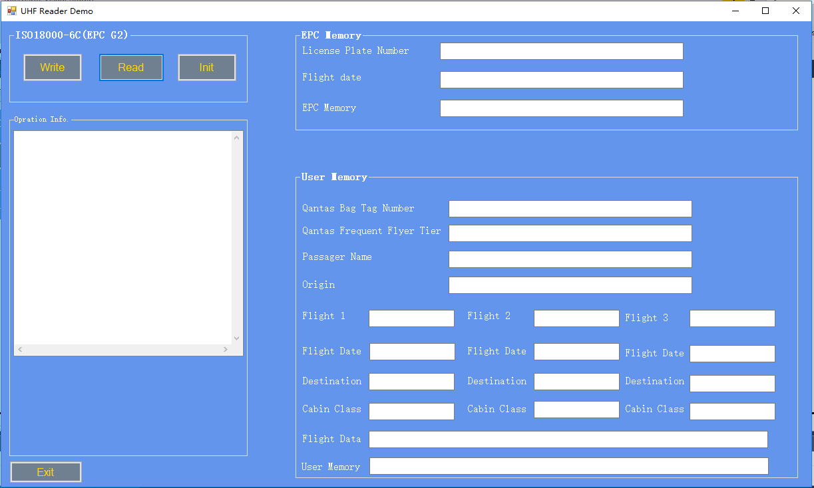
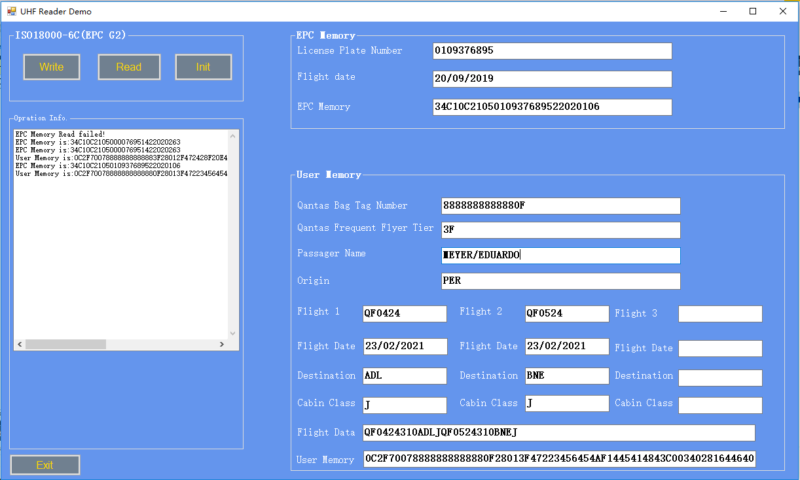
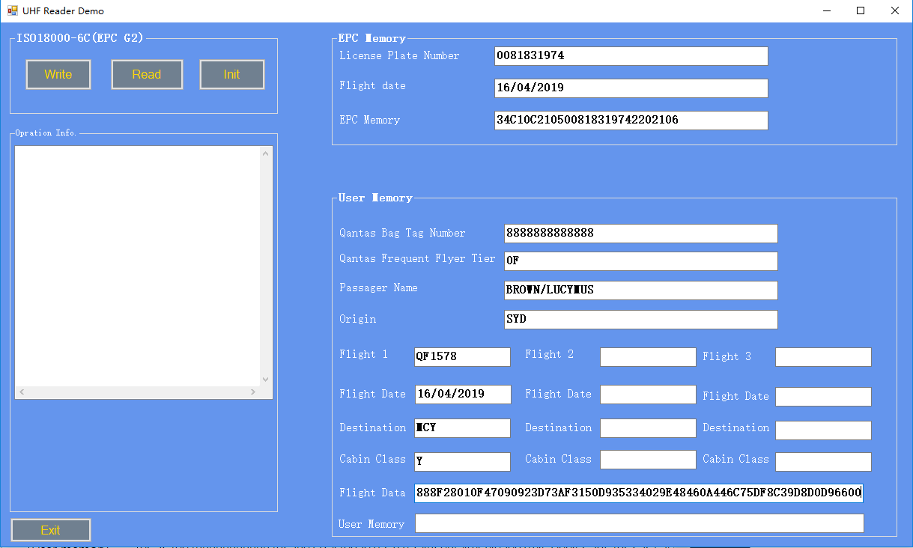
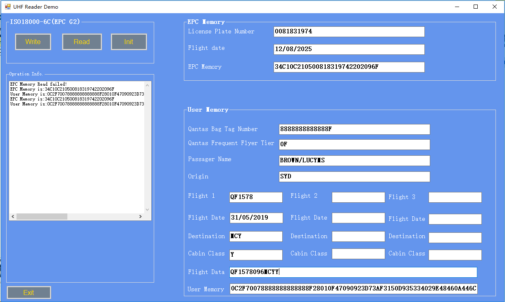

# Qantas_Rfid
Qantas UHF Class-1 Gen-2 Baggage Tag
A C# development demo of RFID.
Dynamic library file name： RfidApiLib.dll.

Installation:   Install-Package Qantas_Rfid

## Server Side
Allows enter port number, easily create a server program, receive data from all clients, and trigger information, displayed in the forms below.

## Client side
Allows read data from tag and write data into tag. 

*Form 1 includes the EPC MEMORY and User MEMORY. 
EPC BANK : *licence plate code; 
           *Flight date
           
User BANK : *QANTAS PBT NUMBER
            *AIRLINE FRENCQUENT FLYER LEVEL
            *ISSUING STATION
            *FLIGHT DATA

*The form demonstrates how to read the tag.
Read

*This form demonstrates entering a complete data command and then requesting the server to return the corresponding data.
Write

Write-read

